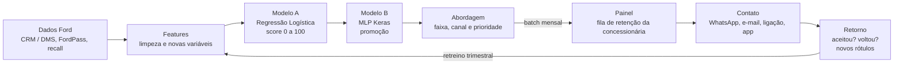

# Sprint 3 – IA & ML · Desafio Ford: retenção no pós-venda (VIN Share)

Projeto da disciplina de IA & ML (Engenharia de Software – FIAP), feito em parceria com a Ford.

A solução prevê quais clientes Ford vão deixar a rede oficial nos próximos 12 meses. Para cada cliente, ela recomenda como fazer a abordagem e qual promoção oferecer. No conjunto de teste, o score de risco atingiu **ROC-AUC de 0,876** e a recomendação de promoção atingiu **F1-macro de 0,727**.

## Estrutura do repositório

| Arquivo | Conteúdo |
| --- | --- |
| `Sprint3_Ford_VINShare_ML.ipynb` | Notebook com todas as etapas, já executado |
| `clientes_ford_sintetico.csv` | Base sintética gerada (10.100 linhas, antes da limpeza) |
| `README.md` | Esta documentação |

---

## 1. Problema e objetivo

Muitos clientes Ford deixam a rede oficial quando a garantia acaba e passam a fazer a manutenção em oficinas independentes. Isso reduz o **VIN Share**, que é a porcentagem de veículos Ford atendidos pela rede oficial.

O objetivo é agir antes que o cliente saia: identificar quem está em risco e sugerir a abordagem e a promoção adequadas, escolhendo entre as promoções que já existem.

O problema foi dividido em duas tarefas de Machine Learning supervisionado:

| Tarefa | Tipo de problema | Alvo | Saída usada no negócio |
| --- | --- | --- | --- |
| A – Risco de evasão | Classificação binária | `evasao` (1 = não voltou à rede em 12 meses) | Score de Risco de 0 a 100 |
| B – Recomendação | Classificação multiclasse (5 classes) | `promocao_aceita` | Promoção recomendada e uma alternativa |

O Score de Risco calculado na Tarefa A é usado como variável de entrada na Tarefa B. O score diz *quem* priorizar, e a Tarefa B diz *o que* oferecer.

## 2. Dados

Como não temos dados reais da Ford, geramos uma **base sintética de 10.000 veículos (VINs)**. Cada linha representa um veículo e seu dono na data de referência (setembro de 2026).

**Alvo A (`evasao`)**

- Gerado por um modelo logístico latente, o que resulta em cerca de 45% de evasão.
- O risco aumenta com o fim da garantia, com o tempo desde a última visita, com a distância até a concessionária e com NPS baixo.
- O risco diminui com o uso do app FordPass, com recall pendente e com o histórico de revisões feitas na rede.
- Uma "fidelidade" não observada adiciona ruído que nenhum modelo consegue explicar.

**Alvo B (`promocao_aceita`)**

Gerado por utilidade aleatória: cada promoção recebe uma pontuação a partir de regras de perfil, soma-se um ruído, e vence a de maior pontuação. As regras são:

| Perfil do cliente | Promoção favorecida |
| --- | --- |
| Carro novo | Pacote de revisões |
| Carro de 3 a 7 anos | Revisão com preço fixo |
| Carro rodado | Desconto em peças |
| Cliente sumido ou insatisfeito | Check-up gratuito |
| Frota (PJ) | Plano frota |

**Variáveis da base**

| Grupo | Variáveis |
| --- | --- |
| Veículo | modelo, ano de fabricação, km atual, garantia ativa, recall pendente |
| Relacionamento | revisões na rede, meses desde a última visita, ticket médio (R$), NPS da última visita, reclamações nos últimos 12 meses, uso do FordPass |
| Cliente | tipo (PF ou PJ Frota), região, distância até a concessionária (km), canal preferido |

**Problemas inseridos de propósito** (para exercitar a preparação dos dados):

- 1% de registros duplicados
- km negativo
- ano de fabricação no futuro
- ticket com erro de digitação (valor 25× maior)
- a mesma região escrita de formas diferentes
- valores ausentes: 12% no NPS, 5% no ticket, 4% na distância e 3% no canal

## 3. Preparação dos dados

Depois da limpeza, a base ficou com **9.967 linhas** (de 10.100). Após a transformação, os modelos recebem **35 features**.

| Problema | Tratamento |
| --- | --- |
| Registros duplicados | Removidos pelo `cliente_id` |
| Região escrita de formas diferentes | Texto padronizado ("SUDESTE", "sul" → "Sudeste", "Sul") |
| km negativo | Valor absoluto (erro de sinal na digitação) |
| Ano de fabricação no futuro | Linha removida (menos de 0,5% da base); a idade do veículo é crítica para o modelo |
| Ticket médio acima de Q3 + 3·IQR (R$ 2.675) | 70 valores transformados em ausentes e depois imputados |
| Valores ausentes | Imputação dentro do pipeline (mediana nas numéricas, moda nas categóricas) + flag `nps_ausente` |

**Variáveis criadas**

- `idade_veiculo`
- `km_por_ano`
- `revisoes_esperadas`: segue o plano Ford de uma revisão a cada 10.000 km ou por ano
- `proporcao_revisoes_rede`: principal indicador de fidelidade
- `fim_garantia_proximo`
- `nps_ausente`

Removemos o identificador (`cliente_id`) e o ano de fabricação, que ficou redundante com a idade do veículo. Nenhuma variável usa informação posterior ao momento da previsão, então não há vazamento de dados.

**Transformação e divisão**

- Um `ColumnTransformer` aplica StandardScaler nas variáveis numéricas e One-Hot Encoding nas categóricas.
- A divisão é **80/20 estratificada**: 7.973 clientes em treino e 1.994 em teste. A mesma divisão vale para as duas tarefas.
- Imputadores e escaladores são ajustados somente com os dados de treino.

## 4. Modelos desenvolvidos

Comparamos três famílias de modelo nas duas tarefas: um baseline linear, um ensemble de árvores e a rede neural MLP.

| Modelo | Por que foi escolhido | Ajuste de hiperparâmetros |
| --- | --- | --- |
| Regressão Logística | Baseline interpretável: os coeficientes explicam o risco para o time comercial | GridSearchCV em C ∈ {0,01; 0,1; 1; 10}, validação cruzada estratificada com 5 folds |
| Random Forest | Captura não linearidades e interações; robusto a outliers | GridSearchCV em max_depth {8, 14, None} × min_samples_leaf {1, 5, 15} |
| MLP (Keras) | Rede neural das aulas, adequada para dados tabulares | 3 arquiteturas na Tarefa A e 2 na Tarefa B; Adam, Dropout e EarlyStopping (paciência de 10 épocas) |

**Configurações da MLP**

| Tarefa | Arquiteturas testadas | Camada de saída | Função de perda |
| --- | --- | --- | --- |
| A | (32), (64-32, dropout 0,2) e (128-64-32, dropout 0,3) | `Dense(1, sigmoid)` | `binary_crossentropy` |
| B | (64-32, dropout 0,2) e (128-64, dropout 0,3) | `Dense(5, softmax)` | `sparse_categorical_crossentropy` |

**Cuidados na Tarefa B**

- O `score_risco` usado no treino é gerado **out-of-fold** (5 folds). Assim, cada cliente recebe o score de um modelo que não o viu durante o treino, o que evita vazamento de dados.
- Usamos `class_weight="balanced"` porque a classe `plano_frota` é minoritária (8% da base).

## 5. Avaliação e comparação

A Regressão Logística venceu a Tarefa A e a MLP (128-64) venceu a Tarefa B. Nas duas tarefas, as diferenças entre os modelos são pequenas. Todos os valores abaixo foram medidos no conjunto de teste (1.994 clientes).

**Métricas escolhidas**

- **ROC-AUC (Tarefa A):** mede a capacidade de *ordenar* os clientes por risco, que é exatamente para que o score é usado.
- **Recall da classe evasão (Tarefa A):** mostra quantos clientes em risco real a solução consegue alcançar.
- **F1-macro (Tarefa B):** as classes são desbalanceadas, e esta métrica dá o mesmo peso a todas as promoções.

### Tarefa A – Risco de evasão (threshold 0,5)

| Modelo | ROC-AUC | Acurácia | Precisão | Recall | F1 |
| --- | --- | --- | --- | --- | --- |
| **Regressão Logística (C = 0,1)** | **0,876** | 0,794 | 0,791 | 0,745 | 0,767 |
| MLP Keras (32) | 0,873 | 0,791 | 0,793 | 0,732 | 0,761 |
| Random Forest (min_samples_leaf = 15) | 0,861 | 0,780 | 0,767 | 0,743 | 0,755 |

Entre as MLPs, a arquitetura mais simples (32) teve o melhor AUC de validação (0,879), com EarlyStopping na 6ª época. Adicionar camadas não melhorou o resultado.

### Tarefa B – Promoção

| Modelo | F1-macro | Acurácia | F1 ponderado |
| --- | --- | --- | --- |
| **MLP Keras (128-64, dropout 0,3)** | **0,727** | 0,721 | 0,720 |
| MLP Keras (64-32, dropout 0,2) | 0,723 | 0,715 | 0,715 |
| Random Forest | 0,715 | 0,707 | 0,706 |
| Regressão Logística | 0,713 | 0,703 | 0,703 |

- A classe mais fácil de acertar foi `pacote_revisoes` (F1 = 0,84). A mais difícil foi `checkup_gratuito` (F1 = 0,64).
- **Ablação:** retirando o score das variáveis da Tarefa B, o F1-macro cai de 0,727 para 0,721. Ou seja, o score contribui pouco para escolher a promoção.

## 6. Conclusão

**Modelos selecionados para a solução final:**

- **Score de risco (Tarefa A):** Regressão Logística
- **Recomendação de promoção (Tarefa B):** MLP Keras (128-64)

**Justificativa**

- **Tarefa A:** a Regressão Logística teve o maior ROC-AUC. Além disso, é interpretável, leve e estável na validação cruzada (desvio padrão ≈ 0,01). A MLP chegou ao mesmo nível, mas custa mais para treinar e explicar sem ganho de desempenho.
    - A relação entre as variáveis e o risco é basicamente monotônica (quanto maior uma variável, maior ou menor o risco, sem inversões).
    - A base sintética foi gerada por um processo logístico, o que favorece esse modelo. Com dados reais, a comparação precisa ser refeita.
- **Tarefa B:** a MLP teve o melhor F1-macro porque as regras de aceitação envolvem interações não lineares, como faixas de idade do veículo e a combinação de frota com o tipo de oferta.

**Principais resultados**

| Faixa do score | % da carteira | Evasão real | Abordagem |
| --- | --- | --- | --- |
| Alto (≥ 70) | 29% | 88% | Ligação do consultor em até 7 dias |
| Médio (40–69) | 20% | 53% | Oferta pelo canal preferido em até 30 dias |
| Baixo (< 40) | 50% | 17% | Comunicação de rotina pelo app ou e-mail |

- **Threshold recomendado: 0,4.** Ele alcança 81% dos clientes que evadiriam, com precisão de 0,75, acionando cerca de metade da carteira.
- **Fatores que mais pesam no risco:**
    - meses desde a última visita
    - garantia ativa
    - proporção de revisões feitas na rede
    - idade do veículo
    - uso do FordPass
    - recall pendente
    - NPS

  Todos esses fatores podem ser usados pela concessionária como alavancas na abordagem.

## 7. Uso na aplicação e deploy

A solução roda em lote uma vez por mês. Cada concessionária recebe uma fila de clientes ordenada por risco, já com o canal e a promoção sugeridos.



- **Batch mensal:** reprocessa toda a base de VINs e atualiza a fila de retenção no painel de cada concessionária.
- **API em tempo real (FastAPI em contêiner Docker):** o endpoint `POST /recomendar` recebe os dados de um cliente e devolve score, faixa, canal e promoção. Pode ser chamado, por exemplo, quando o cliente abre o app FordPass ou agenda um serviço. Corresponde à função `recomendar()` do notebook.
- **MLOps:**
    - versionamento dos modelos no MLflow;
    - monitoramento de *drift* nas variáveis e na taxa de evasão;
    - retreino trimestral, com o resultado de cada campanha virando novo rótulo para as duas tarefas.
- **Medição de impacto:** um grupo de controle, que não recebe abordagem, permite medir o ganho real de VIN Share gerado pela solução.

## 8. Limitações, melhorias e trabalhos futuros

A principal limitação é que todos os resultados vêm de dados sintéticos. O próximo passo é validar a solução com dados reais da Ford.

- **Uplift modeling:** priorizar os clientes que *mudam de comportamento por causa da oferta*, e não apenas os de risco alto. Isso evita gastar desconto com quem voltaria de qualquer jeito.
- **LSTM (aula 4):** usar a sequência de visitas e de quilometragem de cada VIN, em vez de variáveis agregadas.
- **Explicabilidade e calibração:** mostrar a explicação de cada cliente com SHAP no painel do consultor e calibrar as probabilidades.
- **Threshold por custo real:** comparar o custo da promoção com a receita do cliente retido e escolher o threshold que dá o melhor resultado em reais.
- **Autoencoder (aula 2):** segmentar clientes para criar novas campanhas.

## 9. Instale as dependências:

   ```bash
   pip install pandas numpy scikit-learn tensorflow matplotlib seaborn
   ```
